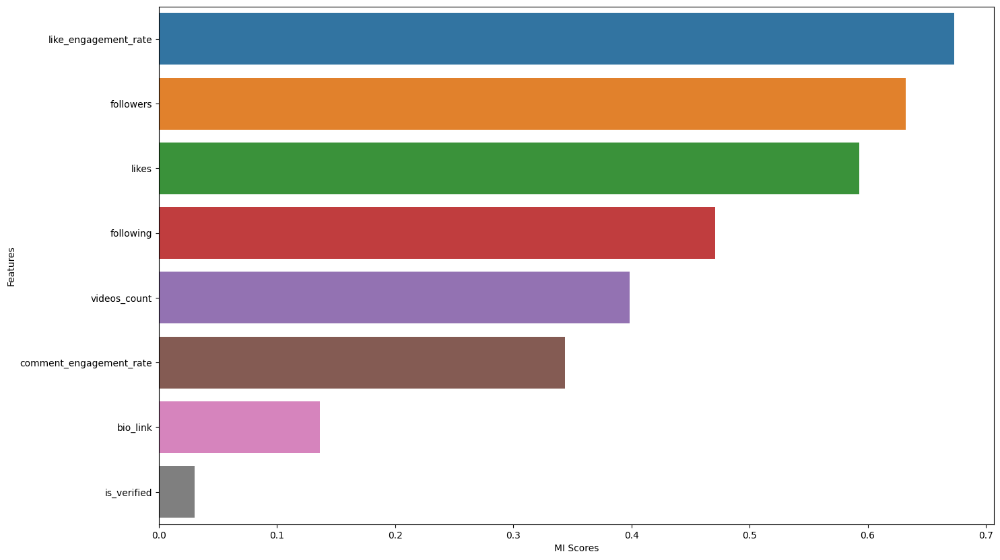
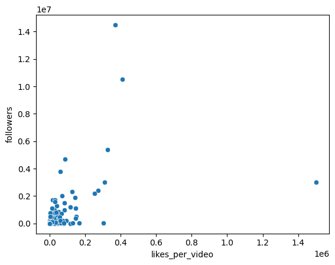
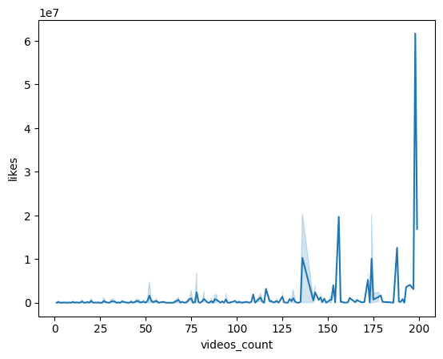
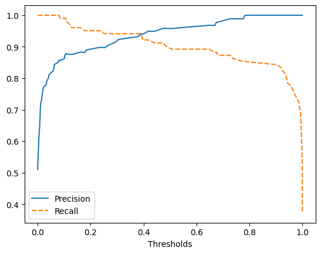

# Tiktok Influencer Insights: Leveraging User Behavior Data to Identify Active Content Creators

## Table of Contents
1. Motivation
2. Project Setup
3. Dataset
4. Data Analysis
5. Data Pipeline and Feature Engineering
6. Machine Learning Model
7. Model Evaluation and Final Results
8. License

## Motivation
This project aims to identify active content creators on TikTok by leveraging user behavior data. It is a binary classification problem where the goal is to classify users into two categories: active content creators and others. This is important as it can help businesses target their marketing efforts more effectively.

## Project Setup
To set up the project, create a virtual environment and activate it using the following commands:

\`\`\`bash
python3 -m venv venv
source venv/bin/activate
\`\`\`

Then, install the dependencies given in the `requirements.txt` file with:

\`\`\`bash
pip install -r requirements.txt
\`\`\`

## Dataset
The dataset used in this project is publicly available on [Kaggle](https://www.kaggle.com/datasets/manishkumar7432698/tiktok-profiles-data).

## Data Analysis
The dataset includes features such as the biography of the user, the average engagement rate, the bio link, the number of followers, following, likes, and whether the profile is verified or not. To get a first feeling for the most important features, mutual information scores were plotted (see screenshot below). As expected, features like the number of followers or the like_engagement_rate play a significant role in determining whether or not a user is a content creator.

There is also a positive correlation between the number of followers and the newly created feature "likes-per-video ratio" as seen in the image below:

Another interesting plot visualizes the "peaks" of the likes per video_count:

## Data Pipeline and Feature Engineering
After doing some more extensive data analysis, here are the final decisions:
1. Biography-column: Missing values were **imputed** and **feature engineering** was performed using **NLP** to check the probability of being a content creator.
2. Likes and followers columns: **Feature engineering** was performed using **PCA** to add two columns that represent the axes with the most amount of variance.
3. Bio_link column: A new **feature was engineered** that indicates if there is a link in the bio or not.
4. Likes and videos_count columns: A new **feature was engineered** that represents the likes_per_video ratio.

## Machine Learning Model
A **Pytorch** fully connected **neural network** was used with the following parameters:

| Parameter         | Value       |
|-------------------|-------------|
| n_layers          | 3           |
| n_units           | 64          |
| dropout_rate      | 0.2         |
| input_shape       | 9           |
| activation        | nn.ReLU()   |
| output_units      | 1           |
| output_activation | nn.Sigmoid()|

The loss function used was binary cross entropy and optimization was done using Adam optimizer with batch size 512 and early stopping.

## Model Evaluation and Final Results
After optimizing the hyperparameters, the best F1 score reached was 93%. The precision and recall tradeoff can be visualized as follows:

In this project, a decision was made to trade a bit of precision for a higher recall in order to identify more active content creators, resulting in a recall of 96% and a precision of 91%.

## License
This project is under [CC0-1.0 license](https://creativecommons.org/publicdomain/zero/1.0/).
